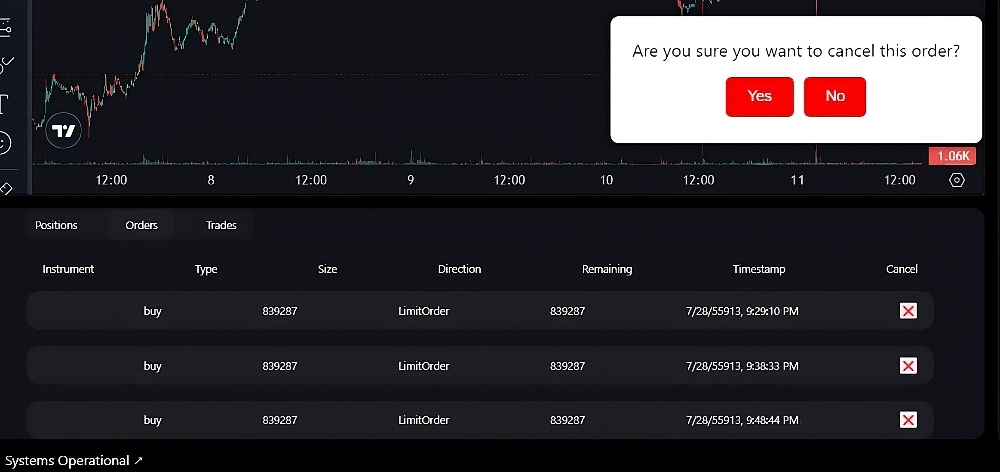
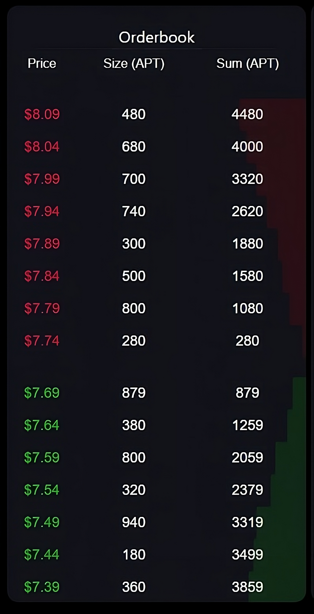
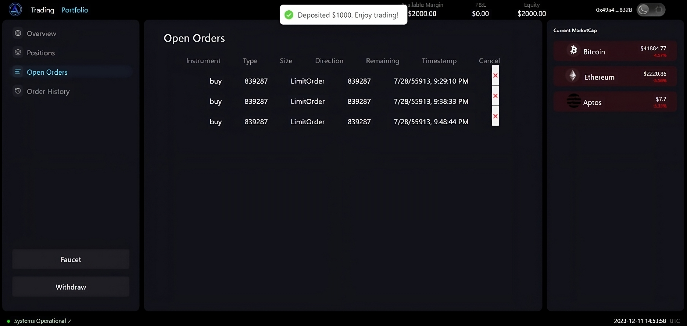
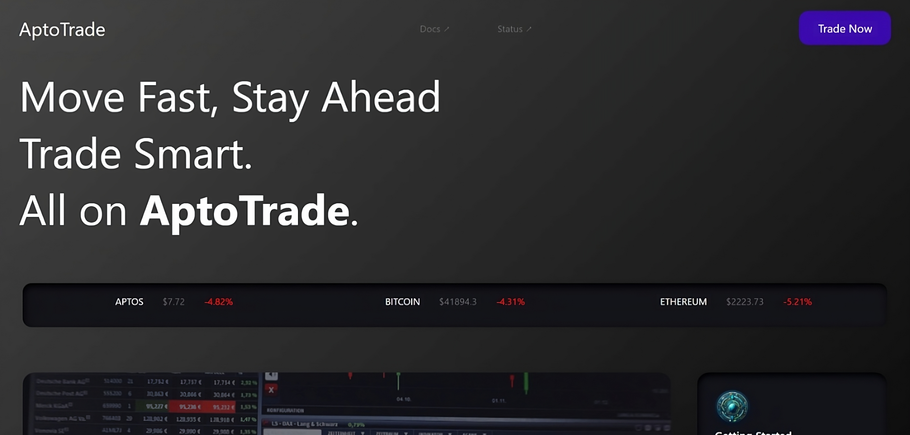
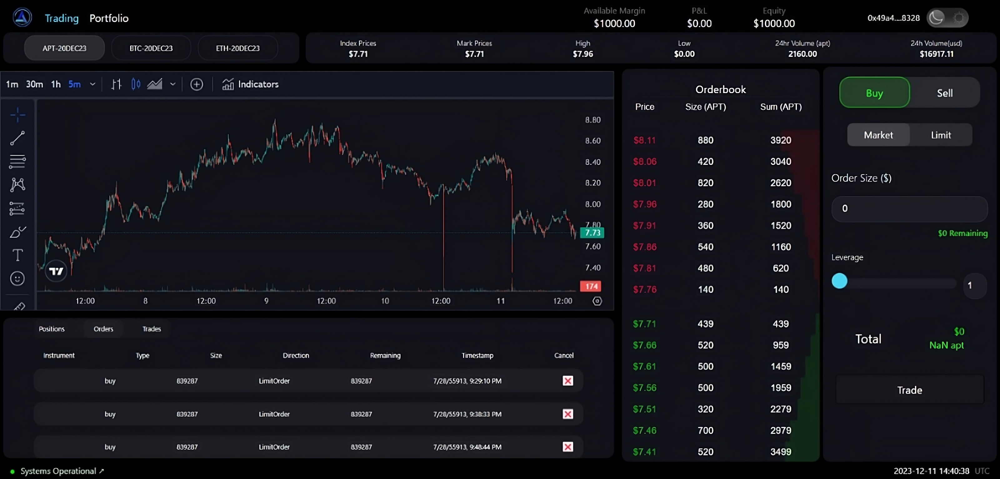
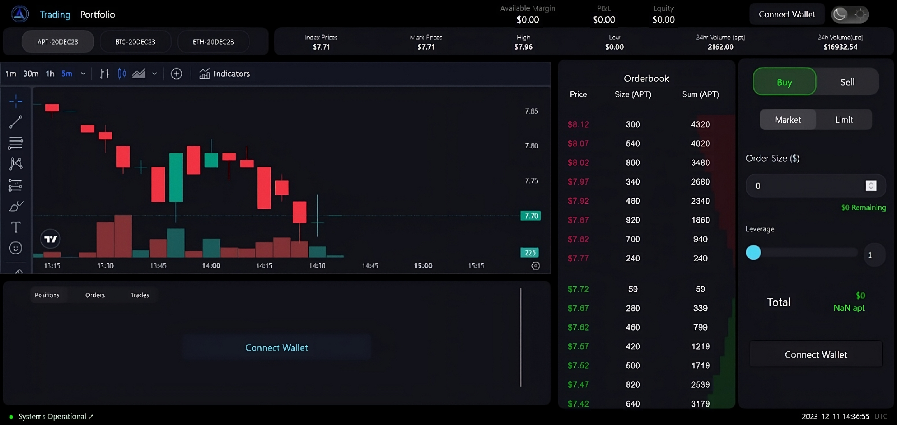
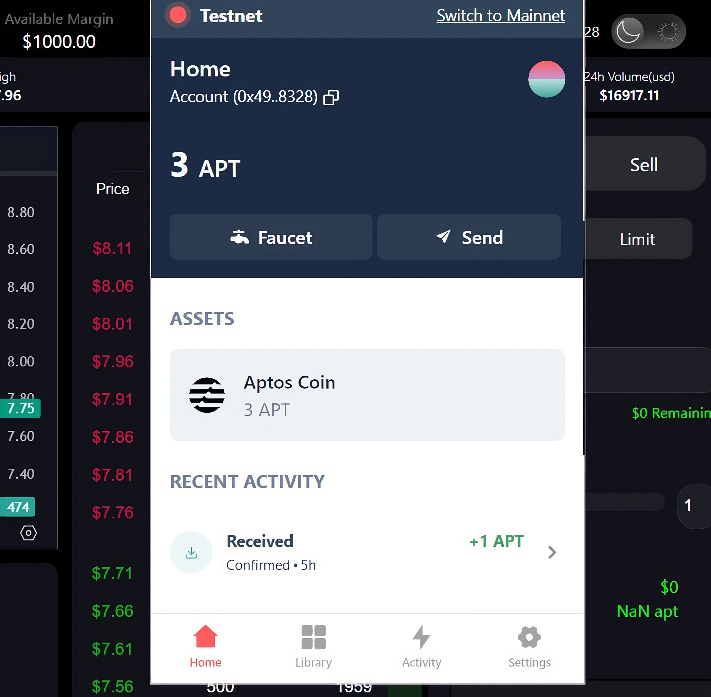
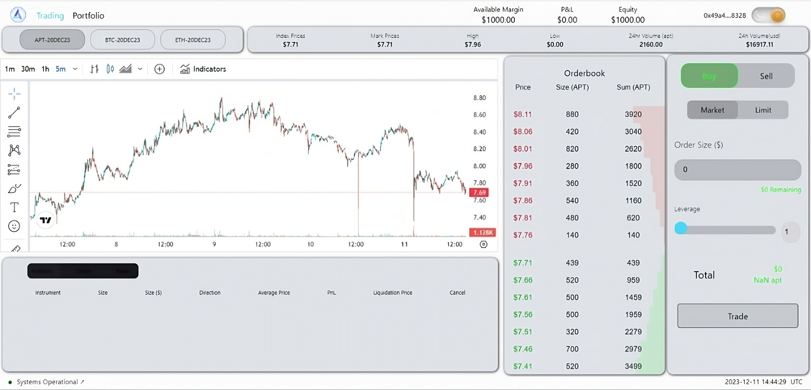

# AptoTrade

AptoTrade is a derivates exchange offering experiable futures, running on Aptos Bloclchain and providing CEX like experience in the decentralized world.

&nbsp;
&nbsp;
&nbsp;
<p align="center">

</p>
&nbsp;
&nbsp;
&nbsp;


## Screenshots

1. Order List <br>


2. Orderbook <br>


3. Portfolio Page <br>


4. Second Home <br>


5. Trading Home <br>


6. Trading Page <br>


7. Wallet <br>


8. White Theme Home Page <br>



## Documentation

This repositary contains 3 sections

- move contracts
- server (api)
- frontend (interface)

The contracts are deployed on the aptos devnet

```
AptEconia=0x5aa5dac7818fefdf095b6001ec7f2607bd7576c8f9a74c5c1a342bad9e8cf889
AptFaucet=0x3f4111e71d011986d24815ce66ce35900c892561d8cf163c41af23100b7d55a7
AptManager=0x2da25555efbb5ac2c6d42a8a02228ba8f25e2b42b3eea9b35516578a43f2a62f
aptUser1=0x004dfdae49d9eb8da8fa88de572eaf57e6161ad4942450e260c7b7f782f67269
```
nbsp;
&nbsp;
&nbsp;

## Running locally

### Server

- To run the server you would need kafka running on your local port 9092

```bash
  brew services start zookeeper
  brew services start kafka
```

```
cd packages/server/src
```

- Next download the requirements.txt files

```
pip3 install -r ./exchange/requirements.txt
pip3 install -r ./api/requirements.txt
pip3 install -r ./pricefeeder/requirements.txt
```

The server contains 3 services which interact with each other. We need to start these services together simultaneously.

In three seprete terminal in the dir /packages/server/src, run

```
python3 -m pricefeeder
```

```
python3 -m api
```

```
python3 -m exchange
```
    
Congratulations! Your server is up and running


### Frontend

Navigate to frontend folder and install the packages

```
cd packagea/frontend
```

```
npm install
```

```
npm run start
```

You are all setup to make your trading MOVE at localhost:3000

&nbsp;
&nbsp;
&nbsp;
## API Reference

After running the server, we have 2 api's

- REST API at port 8081
- Websocket api at port 8082


## Websocket api

### /ticker/{address}

connect to 

```
ws://127.0.0.1:8082/ticker/0xe5748e30195c0c4d15f1fed8d1aeffd28d1208740df096f2a7f8bdf6395628c8
```

### /index/{address}

connect to 

```
ws://127.0.0.1:8082/index/0xe5748e30195c0c4d15f1fed8d1aeffd28d1208740df096f2a7f8bdf6395628c8
```

### /orderbook/{address}

connect to 

```
ws://127.0.0.1:8082/orderbook/0xe5748e30195c0c4d15f1fed8d1aeffd28d1208740df096f2a7f8bdf6395628c8
```

### /account/{address}

connect to 

```
ws://127.0.0.1:8082/account/0xe5748e30195c0c4d15f1fed8d1aeffd28d1208740df096f2a7f8bdf6395628c8
```


## REST API


### public/get_trades_by_instrument
```json
{
    "jsonrpc": "string",
    "id": 0,
    "method": "public/get_trades_by_instrument",
    "params":{ 
            "instrument_name":"ETH-20DEC23"
    }
}
```

### public/get_index_price_names
```json
{
    "jsonrpc": "string",
    "id": 0,
    "method": "public/get_index_price_names",
    "params":{}
}
```

### public/get_currencies 
```json
{
    "jsonrpc": "string",
    "id": 0,
    "method": "public/get_currencies",
    "params":{}
}
```

### public/ticker
```json
{
    "jsonrpc": "string",
    "id": 0,
    "method": "public/ticker", 
    "params":{
        "instrument_name":"ETH-20DEC23"
    }
}
```

### public/get_index_price
```json
{
    "jsonrpc": "string",
    "id": 0,
    "method": "public/get_index_price", 
    "params":{
        "index_name":"BTC/USDC"
    }
}
```

### public/get_instruments
```json
{
    "jsonrpc": "string",
    "id": 0,
    "method": "public/get_instruments", 
    "params":{}
}
```

### public/get_order_book
```json
{
    "jsonrpc": "string",
    "id": 0,
    "method": "public/get_order_book", 
    "params":{
        "instrument_name":"ETH-20DEC23",
        "depth": 10
    }
}
```

### private/deposits
```json
{
    "jsonrpc": "string",
    "id": 0,
    "method": "private/deposit", 
    "params":{
        "from":"0x1234567",
        "currency": "USDC",
        "amount": 3000000
    }
}
```

### private/get_deposits
```json
{
    "jsonrpc": "string",
    "id": 0,
    "method": "private/get_deposits", 
    "params":{
        "from":"0x1234567",
    }
}
```

### private/withdrawls
```json
{
    "jsonrpc": "string",
    "id": 0,
    "method": "private/withdraw", 
    "params":{
        "from":"0x1234567",
        "currency": "USDC",
        "amount": 50000
    }
}
```

### private/get_withdrawals 
```json
{
    "jsonrpc": "string",
    "id": 0,
    "method": "private/get_withdrawals", 
    "params":{
        "from":"0x1234567",
    }
}
```

### private/get_collateral
```json
{
    "jsonrpc": "string",
    "id": 0,
    "method": "private/get_collateral", 
    "params":{
        "from":"0x1234567",
    }
}
```

### private/get_all_trades
```json
{
    "jsonrpc": "string",
    "id": 0,
    "method": "private/get_all_trades", 
    "params":{
        "from":"0x1234567",
    }
}   
```

### private/get_positions
```json
{
    "jsonrpc": "string",
    "id": 0,
    "method": "private/get_positions", 
    "params":{
        "from":"0x1234567",
    }
}   
```

### private/get_account_summary
```json
{
    "jsonrpc": "string",
    "id": 0,
    "method": "private/get_account_summary", 
    "params":{
        "from":"0x1234567",
    }
}   
```

### private/get_open_orders
```json
{
    "jsonrpc": "string",
    "id": 0,
    "method": "private/get_open_orders", 
    "params":{
        "from":"0x1234567",
    }
}   
```

### private/get_account_details
```json
{
    "jsonrpc": "string",
    "id": 0,
    "method": "private/get_account_details", 
    "params":{
        "from":"0x123457082",
    }
}   
```

### private/buy
```json
{
    "jsonrpc": "string",
    "id": 0,
    "method": "private/buy", 
    "params":{
        "from":"0x1234567",
        "instrument_name": "ETH-20DEC23",
        "type": "limit",
        "amount": 2,
        "leverage": 10,
        "price": 2000,
        "signature": "0x12345abc"
    }
}   
```

### private/sell
```json
{
    "jsonrpc": "string",
    "id": 0,
    "method": "private/sell", 
    "params":{
        "from":"0x1234567",
        "instrument_name": "BTC-20DEC23",
        "type": "limit",
        "amount": 8,
        "leverage": 10,
        "price": 2200,
        "signature": "0x12345abc"
    }
}   
```

### private/get_open_orders
```json
{
    "jsonrpc": "string",
    "id": 0,
    "method": "private/get_open_orders", 
    "params":{
        "from":"0x1234567",
    }
}
```

### private/get_positions
```json
{
    "jsonrpc": "string",
    "id": 0,
    "method": "private/get_positions", 
    "params":{
        "from":"0x1234567",
    }
}
```
